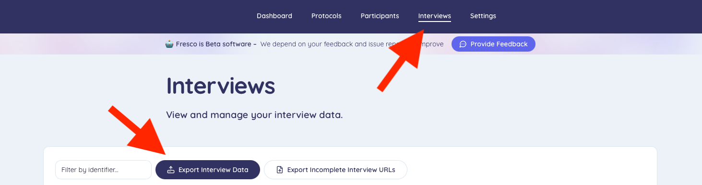

```{r, include = FALSE}
knitr::opts_chunk$set(
  collapse = TRUE,
  comment = "#>"
)
```


`ideanet` includes a function specifically designed to read and process data generated by [Network Canvas](https://networkcanvas.com/), an increasingly popular tool for egocentric data capture. Although `ideanet` does not contain examples of data generated by Network Canvas, we provide a quick guide to using this function here for any interested users.

In this guide, we will:

- Walk through the process of exporting data from Network Canvas.
- Show how to load and clean the data using `nc_read`.
- Demonstrate how to work with the resulting data structures.

## Exporting Data from Network Canvas

Here is a quick introduction to exporting data from Network Canvas. For further details, please refer to the documentation available on the Network Canvas website.

### From Interviewer

To export data from the Interviewer app, follow these steps:

1. Navigate to the **Manage and Export Session Data** section in the Interviewer app.
2. Select the sessions you want to export by clicking on the appropriate cards and choosing **Export Selected to File**.
3. Confirm the export options. In this tutorial, we’ll focus on CSV exports.
4. Select the location on your computer to save the zip file containing the data. Unzip this file to prepare it for analysis in Ideanet.

```{r, echo=FALSE, out.width="100%"}
knitr::include_graphics("interviewer.png")
```

### From Fresco

1. Navigate to the **Interviews** section of the Fresco page.
2. Select the interviews you want to export by clicking on the appropriate check-boxes and choosing **Export Interview Data**.
3. Confirm the export options. In this tutorial, we’ll focus on CSV exports.
4. Select the location on your computer to save the zip file containing the data. Unzip this file to prepare it for analysis in Ideanet.

```{r, echo=FALSE, out.width="100%"}

```

### Data Structure

When exporting data from a Network Canvas protocol, users are given the option to store the data as either a GraphML file or as a series of CSV files contained in a single directory. The `nc_read` function is designed specifically for the latter option, and is quite easy to use provided all files remain in a single directory. The screenshot below provides an example of what this directory should look like. All CSV files exported by the same Network Canvas protocol, regardless of the specific data contained in each file, should be placed within the directory at the same level. `nc_read` will automatically organize the data contained in each CSV file according to the naming conventions Network Canvas gives to each file.

Network Canvas exports data as CSV files that represent three key elements of egocentric networks:

- **Ego Level**: Attributes of the focal actors (egos).
- **Alter Level**: Attributes of the actors connected to each ego (alters).
- **Alter-Alter Ties**: Relationships between the alters themselves (if collected).

```{r, echo=FALSE, out.width="100%"}
knitr::include_graphics("nc_directory.png")
```

## Loading Data with `nc_read`

The `nc_read` function is designed to streamline the process of loading Network Canvas data into R. It handles the CSV files exported by Network Canvas and converts them into a format compatible with egocentric network analysis tools like `ideanet`.

### Function Overview

The `nc_read` function takes the following arguments:

- `path`: The directory where Network Canvas CSV files are located.
- `protocol`: The pathname of the Network Canvas protocol file corresponding to the data being read. While optional, including the protocol file ensures accurate encoding of categorical variables.
- `cat.to.factor`: A logical argument indicating whether categorical variables (originally stored as `TRUE`/`FALSE` columns) should be converted into a single factor column.

### Example Usage

Here’s an example of how to use `nc_read` to load your Network Canvas data:

```{r, eval = F}
nc_data <- nc_read(
  path = "~/Desktop/network_canvas_directory/",
  protocol = "~/Desktop/protocol.json",
  cat.to.factor = TRUE
)

# Split the list into the global environment
list2env(nc_data, .GlobalEnv)
```

In this example, `nc_read` reads all the CSV files in the specified directory and returns a list containing three dataframes:

- **egos**: Information about the egos.
- **alters**: Information about the alters connected to each ego.
- **alter_edgelist**: A dataframe representing alter-alter ties, if available.

## Input to `ego_netwrite`

Conveniently, the files output by `nc_read` are structured as inputs to `ego_netwrite`.

```{r, eval = F}
ego_netwrite(egos = egos, ego_id = "ego_id",
             alters = alters, alter_id = "alter_id", alter_ego = "ego_id",
             alter_alter = alter_edgelists, aa_ego = "ego_id", i_elements = "from", j_elements = "to", directed = F)
```

Users should refer to the `ego_netwrite` vignette for further details on ego-network analysis in `ideanet`.
