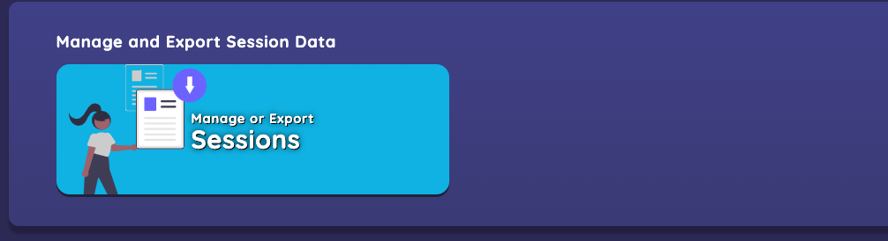
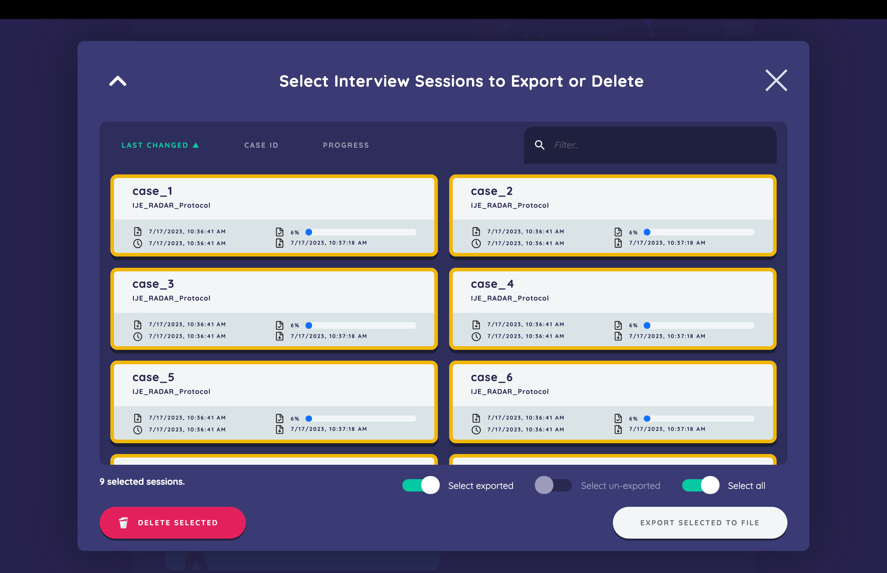
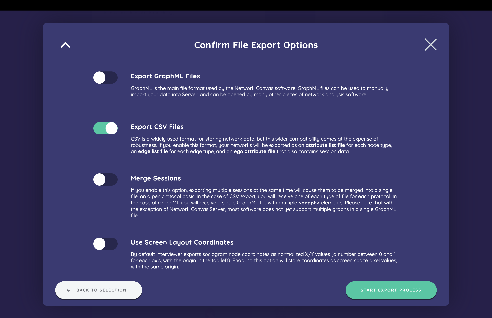
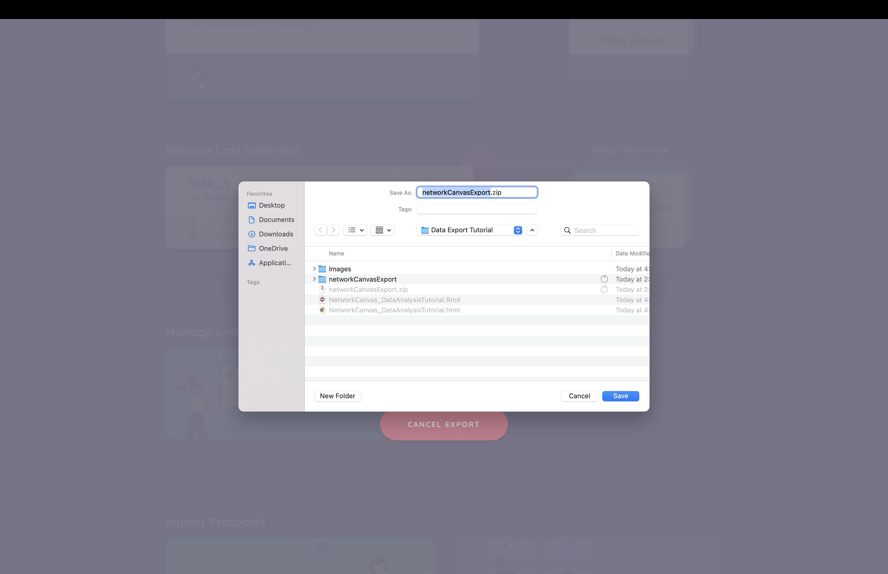
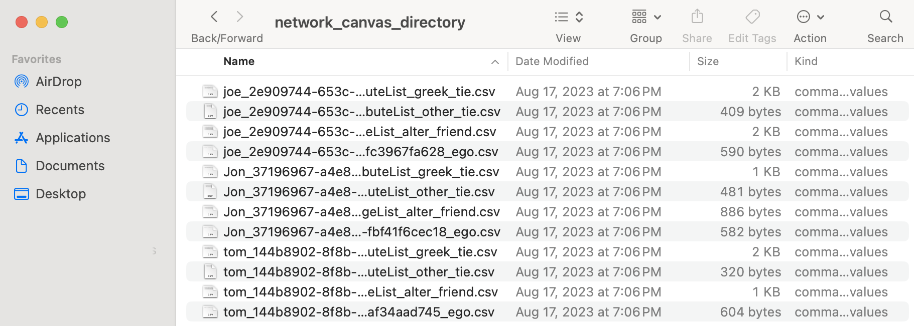

```{r, include = FALSE}
knitr::opts_chunk$set(
  collapse = TRUE,
  comment = "#>"
)
```


[Network Canvas](https://networkcanvas.com/) is a free and open-source software for collecting egocentric network data. While other tools exist for capturing these data, Network Canvas is designed around the needs of both researchers and participants alike, making it an increasingly popular tool for collecting egocentric networks. Network Canvas protocols are developed using a desktop application, entitled Network Canvas Architect. Once a researcher has constructed their protocol in Architect, the protocol is administered to participants either natively on a device running the Network Canvas Interviewer application, or remotely in a web browser using Network Canvas Fresco, currently in development.

Given Network Canvas's increasing popularity, `ideanet` offers a function for reading data collected using Network Canvas, `nc_read`. `nc_read` allows users to make quick use of Network Canvas data in R, and was developed using the input of Network Canvas developers. The following vignette provides an overview of how to export data from Network Canvas Interviewer or Fresco, how to read it into R using `nc_read`, as well as how to quickly process these data and generate measurements using `ideanet`'s `ego_netwrite` function.


## Exporting Data from Interviewer or Fresco

### Interviewer

The first step in exporting data from Network Canvas Interviewer is to navigate to the *Manage and Export Session Data* section of the Interviewer app.

{width=90%}

Next, you’ll indicate which sessions you want to export by selecting the appropriate cards and clicking “Export Selected To File.”

{width=90%}

Next, we’ll confirm export options. Interviewer and Fresco provide the option to export data as either a GraphML file or a directory of CSV files. `nc_read` is only designed to read in the directory of CSVs, so users will want to select only this option. We also recommend that the “Merge Sessions” option be unselected.

**NOTE: Interviewer and Fresco allow users to export data collected by different Network Canvas protocols simultaneously. However, `nc_read` is designed to only work with data generated by a single protocol. Please ensure that all interviews being exported are from the same protocol. `nc_read` will check if this is the case and return an error message if it finds data frome multiple protocols.**

{width=90%}

After a short wait, we simply select where we would like the zip file containing our CSV files to be saved on our computer. We will need to unzip the file before starting our data analysis described below.

{width=90%}

### Fresco

Network Canvas Fresco generates data files identical to those generated using Interviewer. However, the process for exporting these files differs slightly. Once interviews have been completed using Fresco, users can export data from the *Interviews* page (you can also view the export status of each interview from this page).

To export selected interviews:

1. Navigate to the interviews page in the dashboard.

2. Select the checkboxes next to the interviews you wish to export.

3. Click the "export selected" button at the bottom of the table.

4. Select "CSV" as the export options that you wish to use.

5. Click "Start export process".

To export all interviews:

1. Navigate to the "interviews" page in the dashboard.

2. Click the "Export Interview Data" button.

3. Select "Export all interviews" from the dropdown.

4. Select "CSV" as the export options that you wish to use.

5. Click "Start export process".

To export all unexported interviews:

1. Navigate to the "interviews" page in the dashboard.

2. Click the "Export Interview Data" button.

3. Select "Export all unexported interviews" from the dropdown.

4. Select "CSV" as the export options that you wish to use.

5. Click "Start export process".

## Working with Network Canvas CSVs

Provided you selected all export options described to this point, the screenshot below provides an example of what this a Network Canvas data directory should look like. All CSV files in this folder correspond to the a single Network Canvas protocol, regardless of the specific data contained in each file. 

{width=90%}

While users may be tempted to organize these CSVs by the kind of data they store, `nc_read` requires all files to remain in the same directory at the same level. `nc_read` automatically organizes the data contained in each CSV file according to the naming conventions Network Canvas gives to each file, eliminating the need for users to do so themselves. If your directory of CSVs looks like the example above, you should be ready to start using `nc_read`.

## Using `nc_read`

The `nc_read` function takes three arguments:

* `path`: A character value indicating the directory in which Network Canvas CSVs are located.
* `protocol`: A character value indicating the pathname of the Network Canvas protocol file (a `.netcanvas` file) corresponding to the data being read. Because some users may possess data without having the corresponding protocol file on hand (as might occur in a secondary data analysis), protocol files are not required for using `nc_read`. However, including the protocol file better ensures accurate encoding of categorical variables in the data.
* `cat.to.factor`: A logical value indicating whether categorical variables, originally stored as a series of `TRUE`/`FALSE` columns, should be converted into a single factor column.

Below is an example of how the `nc_read` is used in practice:

```{r nc_read, eval = FALSE}
nc_data <- nc_read(path = "~/Desktop/network_canvas_directory/",
                   protocol = "~/Desktop/protocol_directory/nc_protocol.netcanvas"
                   cat.to.factor = TRUE)
```

`nc_read` will read in all CSV files located in the specified directory, process them, and return a list containing a formatted ego list (named `egos`), alter list (named `alters`), and alter-alter edgelist (if applicable, this will be named `alter_edgelist`). If multiple edge types exist for ego-alter and/or alter-alter ties, edgelists for each type of tie are stored as individual data frames as elements in a list. 

## Using `nc_read` with `ego_netwrite`

The various dataframes created by `nc_read` are formatted for use with `ideanet`'s `ego_netwrite` function. If a Network Canvas protocol features only one type of alter and only one type of alter-alter tie, users need only specify the `egos`, `alters`, and `alter_edgelists` items as the ego list, alter list, and alter-alter edgelist (respectively) where `ego_netwrite` asks for them. `ego_netwrite` also asks users to specify the names of columns containing unique identifiers in the ego list, alter list, and alter-alter edgelist. For your convenience, `nc_read` creates new identifier columns whose simple names can be used in lieu of Network Canvas's original identifiers:


```{r ego_netwrite, eval = FALSE}
nc_netwrite <- ego_netwrite(egos = nc_data$egos,
                            ego_id = "ego_id",
                            alters = nc_data$alters,
                            alter_id = "alter_id",
                            alter_ego = "ego_id",
                            alter_alter = nc_data$alter_edgelists,
                            aa_ego = "ego_id",
                            i_elements = "from",
                            j_elements = "to")
```

### Multiple "Types" of Alters

Network Canvas allows users to build protocols that capture multiple "types" of alters. This feature is intended to collect distinct ego networks from participants whose nodes are categorically different from one another. For example, a single protocol may capture networks of *persons*, *places*, and *organizations* to which participants are connected. Although one could hypothetically identify ties between these different types of nodes and treat them as different "modes" in a bipartite network, Network Canvas is designed such that alters may only be tied to other alters of the same type. 

This has important implications for how to use `nc_read`'s output with `ego_netwrite`: users should  use `ego_netwrite` to process networks associated with only one alter type at a given time. In practice, this means using only one dataframe contained within the `alters` element of `nc_read`'s output at a time. Further, users must take care to include only the alter-alter edgelist(s) associated with this alter type as `ego_netwrite`'s input.

### Mutiple Types of Alter-Alter Ties

While Network Canvas does not record ties between alters of different types, it still supports the capture of *different types of ties* between two alters of the same type. For example, a Network Canvas protocol capturing people in a participant's network can record whether these people are connected to each other as *friends*, *family members*, *romantic partners*, or some combination of these categories. When processing data from this protocol, `nc_read` will store three data frames within the  `alter_edgelists` item in its output, each containing the alter-alter edgelist for a particular type of tie. 

`ego_netwrite` can process and analyze networks containing all three of these types of ties at once, but users will have to reshape `nc_read`'s output a bit to do so. This reshaping entails combining all alter-alter edgelists pertinent to a single alter type into a single data frame. The code below shows how one might prepare their `nc_read` output to analyze multirelational ego networks using the example described above:

```{r ego_netwrite_multi, eval = FALSE}
# Extract ego list and pertinent alter list and alter-alter edgelists
egos <- nc_data$egos
people <- nc_data$alters$people
people_ties <- dplyr::bind_rows(nc_data$alter_edgelists$friends,
                                nc_data$alter_edgelists$family,
                                nc_data$alter_edgelists$romantic)

# Feed these objects into `ego_netwrite` and indicate identifier variables
nc_people <- ego_netwrite(egos = egos,
                            ego_id = "ego_id",
                            alters = people,
                            alter_id = "alter_id",
                            alter_ego = "ego_id",
                            alter_alter = people_ties,
                            aa_ego = "ego_id",
                            i_elements = "from",
                            j_elements = "to",
                            aa_type = "edge_type")
```

Upon completion, `ego_netwrite` returns its own list of outputs containing an updated ego list, alter list, and alter-alter edgelist. Included in these objects are summary measures for each individual node and ego network recorded in the Network Canvas dataset. `ego_netwrite` also generates an overall summary of the Network Canvas dataset, which allows users to identify the typical properties of networks in their data. And should users wish to perform additional tasks on their networks, including visualization, `ego_netwrite` creates `igraph` objects for each individual ego network contained in the dataset. While we do not discuss these outputs at length in this vignette, a detailed summary of them can be found in this package's *Analyzing Egocentric Networks* vignette:

```{r ego_netwrite_vignette, eval = FALSE}
vignette("ego_netwrite", package = "ideanet")
```


## Using `nc_read` with `egor`

Some users may prefer to analyze Network Canvas data with the `egor` package instead of `ego_netwrite`. `egor` is especially convenient for fitting exponential random graph models (ERGMs) using egocentric data, which allow researchers to simulate and estimate global network structures for settings where sociocentric data capture is not possible. 

Creating `egor` objects from `nc_read`'s output follows a similar process to that of using `ego_netwrite`. However, it requires the additional step of installing `egor` if you have not already done so:

```{r egor_install, eval = FALSE}
install.packages("egor")
```

Once the `egor` package is installed, users can use the `egor` function to create their object. Just like `ego_netwrite`, the `egor` function asks users for an ego list, and alter list, and an alter-alter edgelist. Users must also provide the names of columns containing unique identifiers linking the ego list, alter list, and alter-alter edgelist, just as they have to do when using `ego_netwrite`:

```{r egor, eval = FALSE}
# Create `egor` object
nc_egor <- egor::egor(alters = nc_data$alters,
                          egos = nc_data$egos,
                          aaties = nc_data$alter_edgelists,

                          ID.vars = list(
                            ego = "ego_id",
                            alter = "alter_id",
                            source = "from",
                            target = "to"
                          ))

# Inspect and analyze `egor` object
summary(nc_egor)
egor::ego_density(nc_egor)
```

Unlike `ego_netwrite`, `egor` does not contain an argument allowing users to identify whether alter-alter ties are of multiple types. If users working with `egor` have networks containing a single type of alter but multiple types of ties between alters, they may find it best to create separate `egor` objects for each type of alter-alter tie present in the network:

```{r egor_mult, eval = FALSE}

# Extract ego list and pertinent alter list and alter-alter edgelists
egos <- nc_data$egos
people <- nc_data$alters$people

friends <- nc_data$alter_edgelists$friends
family <- nc_data$alter_edgelists$family
romantic <- nc_data$alter_edgelists$romantic

# `egor` object for friendship ties
friends_egor <- egor::egor(alters = people,
                          egos = egos,
                          aaties = friends,

                          ID.vars = list(
                            ego = "ego_id",
                            alter = "alter_id",
                            source = "from",
                            target = "to"
                          ))

# `egor` object for family ties
family_egor <- egor::egor(alters = people,
                          egos = egos,
                          aaties = family,

                          ID.vars = list(
                            ego = "ego_id",
                            alter = "alter_id",
                            source = "from",
                            target = "to"
                          ))

# `egor` object for romantic ties
family_egor <- egor::egor(alters = people,
                          egos = egos,
                          aaties = romantic,

                          ID.vars = list(
                            ego = "ego_id",
                            alter = "alter_id",
                            source = "from",
                            target = "to"
                          ))
```

On a concluding note, it is quite easy for users to employ `egor` and `ego_netwrite` for different purposes. `ego_netwrite` provides users the option to create an `egor` object alongside its other standard outputs. Selecting this option, which is further described in the *Analyzing Egocentric Networks* vignette, allows users to take advantage of a wider set of tools for egocentric network analysis.


